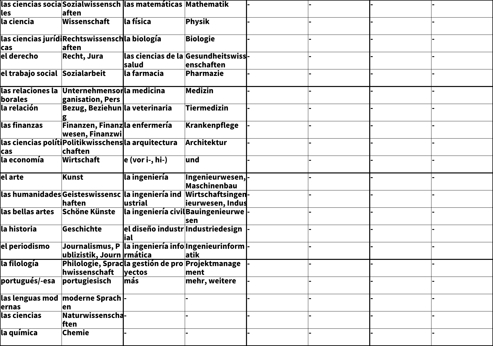

# Anki-2-Real-Flashcard

Simple script which can read a anki database and output images to print on real flashcards

Example output:

## How to use this

In the script `anki_2_paper.py` set the path to your anki Collection, user name and deck name.
Now mark all cards which you want to have on the image with the tag given by the variable `print_tag`.

A second script `merge_text_columns.py` can be used to merge two files.
This script merges each row of file one with the matching row 1 of the second file.
If file one has in row one `test1` written.
And file two has in row one `test2` written.
The resulting file will have in row one `test1;test2` written.

This can be useful to import vocabulary, which was scanned with an OCR system, into anki.
